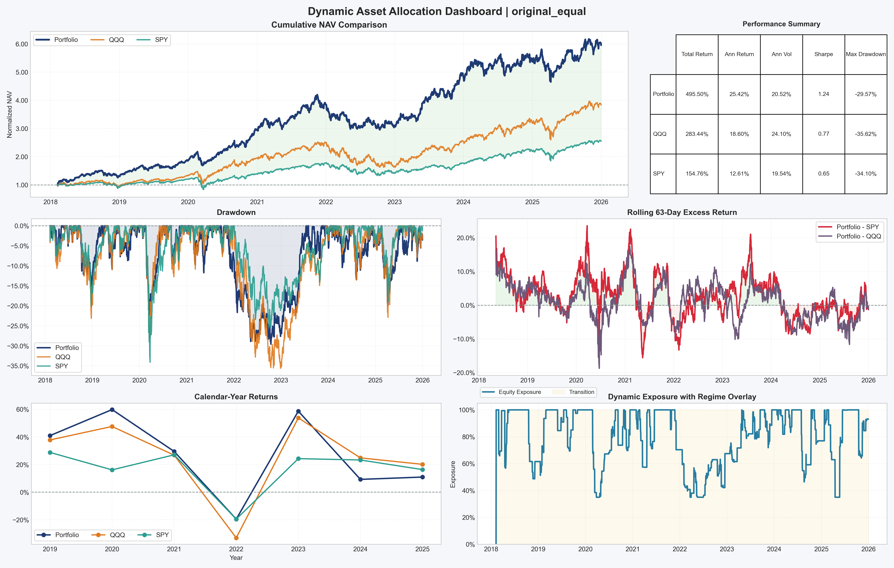
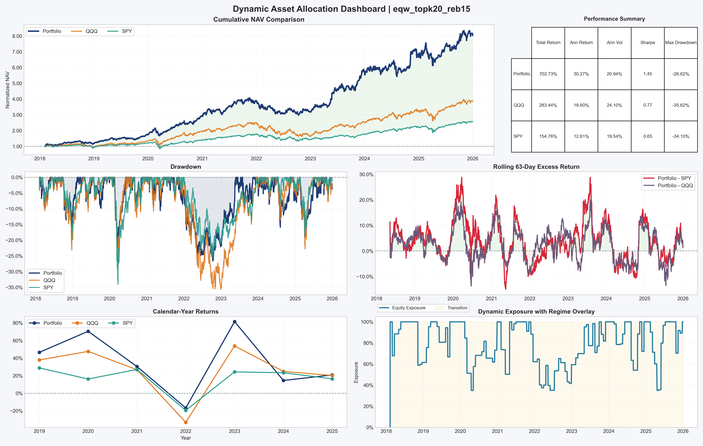
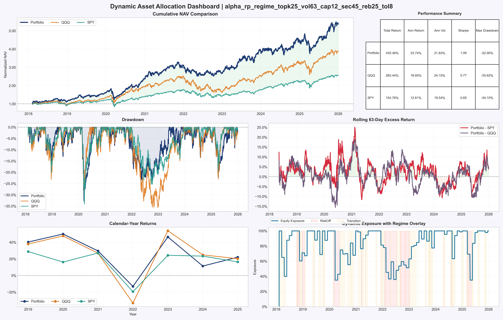
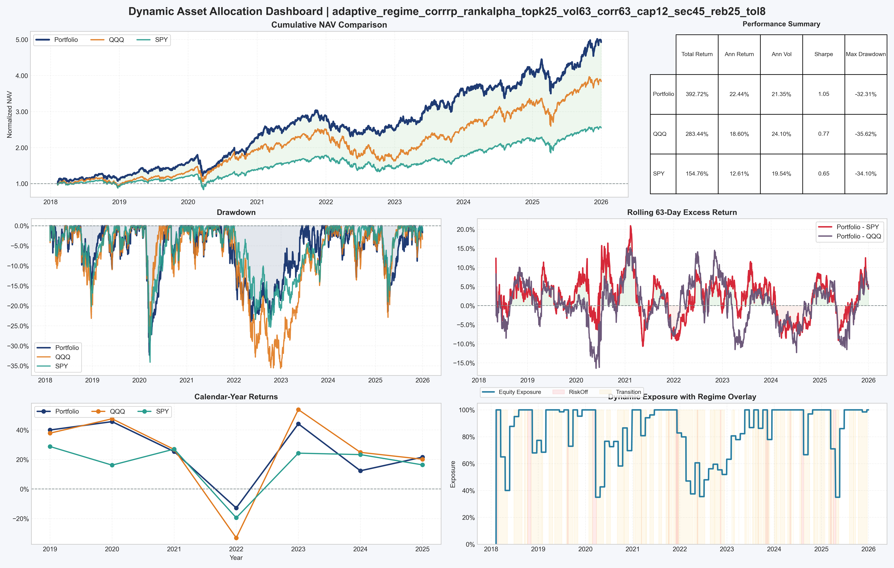

# Ray Blog: From Original Equal to Adaptive Alpha

## 0. Diagnostics First: What Was Tested and What "PASS" Means
All strategy checks come from `backtest_result/<strategy_dir>/diagnostics/flags.csv`.

### 0.1 Core checks used in this report
| Check name in diagnostics | Meaning | PASS rule |
|---|---|---|
| `ranking_alpha_significance` | Is strategy ranking better than random Top-N in MC test | `p_sh_ge_actual <= 0.05` |
| `cost_robust_30bps` | Can strategy survive 30 bps fee stress | At `fee=0.003`: `ann_ret > 0`, `sharpe > 0`, `edge_per_trade > 0` |
| `oos_sharpe_decay` | IS/OOS Sharpe decay sanity | Decay in `[-0.5, 0.5]` |
| `lag_sensitivity` | 1-day extra lag should not collapse Sharpe | No major collapse flag |
| `accounting_identity` / `weight_constraints` | Backtest accounting and long-only constraints | Identity/constraints hold |

### 0.2 Strategy directory mapping (so each PASS is unambiguous)
| Label in blog | Exact strategy directory |
|---|---|
| Original Equal | `original_equal` |
| EQW initial | `eqw_topk20_reb20` |
| EQW improved | `eqw_topk20_reb15` |
| Alpha RP Regime | `alpha_rp_regime_topk25_vol63_cap12_sec45_reb25_tol8` |
| Adaptive CorrRP RankAlpha | `adaptive_regime_corrrp_rankalpha_topk25_vol63_corr63_cap12_sec45_reb25_tol8` |

---

## 1. Project Narrative
This project follows a clear strategy evolution path under the same data and backtest framework:

1. `original_equal` as the baseline.
2. `eqw_topk20` as a ranking-aware equal-weight strategy.
3. `alpha_rp_regime` to combine alpha signal and risk-parity style weighting.
4. `adaptive_regime_corrrp_rankalpha` to add correlation-aware robustness.

All strategy diagnostics are evaluated on the same aligned window:
- Date range: `2018-02-08` to `2025-12-31`
- Trading days: `1985`
- Tradable columns: `80`

---

## 2. Baseline: Original Equal

### 2.1 Core Logic
`original_equal` equally weights all selected names on each trade date and does not use cross-sectional alpha strength.

```python
if day_tics:
    w = 1.0 / len(day_tics)
    for tic in day_tics:
        current_weights[tic] = w
```

### 2.2 Baseline Weaknesses
Even though baseline diagnostics are acceptable (`ranking_alpha_significance = PASS`, `cost_robust_30bps = PASS`), it has structural limitations:

1. It does not exploit `predicted_return` ranking information.
2. It lacks explicit risk-aware reallocation (volatility, concentration, correlation).
3. It has no signal-strength-aware trade gating.

---

## 3. Step 1 Upgrade: EQW Top-N

### 3.1 Why this step
Before moving to a more complex architecture, we first improved the baseline with minimal and interpretable changes:

1. From "all selected equal weight" to "Top-N equal weight".
2. Sector-neutral residual scoring with robust z-score.
3. Historical IC-based signal direction (history-only).
4. Dynamic `top_n` and rebalance controls.

### 3.2 Key implementation signals

```python
rebalance_every_n_days: int = 15
dynamic_top_n_min: int = 10
dynamic_top_n_max: int = 22

residual = raw - sec_mean
z = self._robust_zscore(residual)
score = z * (-1.0 if int(alpha_direction) < 0 else 1.0)
```

### 3.3 Result
The initial `eqw_topk20_reb20` version had a Monte Carlo significance warning.
After tuning the rebalance interval and dynamic Top-N range, `eqw_topk20_reb15` reached:

1. `ranking_alpha_significance = PASS`
2. `cost_robust_30bps = PASS`

---

## 4. Stock Universe Profile from `stock_selected`

To justify the alpha-oriented strategy direction, we profiled the selected universe using:
- Observation-level composition (`ticker-date` rows),
- Unique ticker composition,
- Most frequently selected names.

The analysis code is provided in:
- [stock_selected_analysis.py](./stock_selected_analysis.py)

Generated tables are exported at the same directory level as this blog:
- [stock_selected_sector_observation_table.csv](./stock_selected_sector_observation_table.csv)
- [stock_selected_sector_unique_tickers_table.csv](./stock_selected_sector_unique_tickers_table.csv)
- [stock_selected_top_tickers_table.csv](./stock_selected_top_tickers_table.csv)

### 4.1 Sector composition (summary)

| GICS Sector | Observation Share | Unique Ticker Share |
|---|---:|---:|
| Information Technology (45) | 62.69% | 50.00% |
| Communication Services (50) | 15.83% | 12.50% |
| Consumer Discretionary (25) | 11.28% | 15.00% |

Combined share of these three sectors in observations: **89.80%**.

This concentration explains why alpha ranking and risk controls are highly relevant for this universe.

### 4.2 Top selected names (examples)
`CDW`, `TEAM`, `ZS`, `WDAY`, `QCOM`, `NVDA`, `PANW`, `AMAT`, plus `WBD` in Communication Services.

---

## 5. Step 2 Upgrade: Alpha RP Regime

### 5.1 Design goal
Move from equal-weighted selection to alpha-aware, risk-aware allocation:

1. Alpha-strength-aware weighting.
2. Inverse-volatility scaling.
3. Rebalance gating + turnover cap for cost robustness.

### 5.2 Key implementation signals

```python
raw = inv_vol.to_numpy() * alpha.to_numpy(dtype=float)
```

```python
allow_trade = (
    ic_abs >= float(cfg.min_ic_abs_to_rebalance)
    or drift_l1 >= float(cfg.force_rebalance_drift)
)
```

```python
max_turnover_per_rebalance: float = 0.45
max_turnover_per_rebalance_weak: float = 0.3825
```

### 5.3 Result
`alpha_rp_regime_topk25_vol63_cap12_sec45_reb25_tol8` achieves:

1. `ranking_alpha_significance = PASS`
2. `cost_robust_30bps = PASS`

while reducing average turnover to around `0.0161`.

---

## 6. Step 3 Upgrade: Adaptive CorrRP RankAlpha

### 6.1 Design goal
Add correlation-aware robustness on top of alpha + RP:

1. Penalize crowded/high-correlation clusters.
2. Preserve alpha ranking while improving diversification behavior.

### 6.2 Key implementation signals

```python
corr_penalty = self._correlation_penalty(corr_hist).reindex(tics).fillna(1.0)
raw = inv_vol.to_numpy() * corr_penalty.to_numpy() * rank_alpha.to_numpy(dtype=float)
```

```python
allow_trade = (
    ic_abs >= float(cfg.min_ic_abs_to_rebalance)
    or drift_l1 >= float(cfg.force_rebalance_drift)
)
```

### 6.3 Result
`adaptive_regime_corrrp_rankalpha_topk25_vol63_corr63_cap12_sec45_reb25_tol8` also reaches:

1. `ranking_alpha_significance = PASS`
2. `cost_robust_30bps = PASS`

with average turnover around `0.0163`.

---

## 7. Performance and Diagnostics Comparison

| Strategy | Ann. Return | Sharpe | MC `p_sh_ge_actual` | Edge/Trade @30bps | Turnover Mean | Ranking Flag | Cost Flag | Final NAV |
|---|---:|---:|---:|---:|---:|---|---|---:|
| `original_equal` | 0.2477 | 1.2070 | 0.0099 | 0.000604 | 0.0355 | PASS | PASS | 5.9550 |
| `eqw_topk20_reb20` (initial) | 0.2549 | 1.2319 | 0.0846 | 0.000669 | 0.0268 | WARN | PASS | 6.2851 |
| `eqw_topk20_reb15` (improved) | 0.2865 | 1.3682 | 0.0099 | 0.001821 | 0.0310 | PASS | PASS | 8.0273 |
| `alpha_rp_regime_..._reb25_tol8` | 0.2371 | 1.0859 | 0.0099 | 0.000929 | 0.0161 | PASS | PASS | 5.3547 |
| `adaptive_..._reb25_tol8` | 0.2254 | 1.0561 | 0.0198 | 0.000929 | 0.0163 | PASS | PASS | 4.9272 |

Interpretation:

1. The improved EQW version has the strongest growth in this sample window.
2. Alpha/Adaptive variants trade lower turnover for stronger cost robustness.
3. All three improved lines pass the key diagnostics (`ranking` and `cost`).

---

## 8. Dashboard Review






### 8.1 Cross-Strategy Reading (Side-by-Side)
| Strategy | NAV Curve | Drawdown | Rolling Excess vs Benchmarks | Exposure/Regime Behavior | One-line takeaway |
|---|---|---|---|---|---|
| Original Equal | Strong baseline growth (`final NAV ~5.95`) | Moderate (`max DD ~-29.6%`) | Positive most of the time, weaker recently | Mostly transition-state exposure | Good baseline, but alpha signal is underused |
| EQW Top20 (reb15) | Best growth (`final NAV ~8.03`) | Shallowest DD (`~ -26.6%`) | Most stable positive excess | High participation with limited de-risk windows | Best overall risk-return in this sample |
| Alpha RP Regime | Lower slope (`final NAV ~5.35`) | Deeper DD (`~ -32.9%`) | Still strong positive excess frequency | Explicit regime adaptation + turnover control | Better execution discipline, lower turnover |
| Adaptive CorrRP RankAlpha | Most conservative slope (`final NAV ~4.93`) | Similar DD to Alpha RP (`~ -32.3%`) | Positive excess, but less aggressive yearly win-rate vs QQQ | Smoother regime switching with correlation penalty | Most defensive/robust variant |

### 8.2 Practical Conclusion from Dashboards
1. If the objective is maximum growth in this window, `EQW Top20 (reb15)` is the strongest.
2. If the objective is stronger execution discipline and cost-aware robustness, `Alpha RP` and `Adaptive` are more balanced choices.
3. `Original Equal` remains a reliable baseline, but it leaves alpha on the table compared with ranking-aware strategies.
4. The four dashboards together show a clean trade-off frontier: growth (`EQW`) vs robustness/discipline (`Alpha/Adaptive`).

---

## 9. Remaining Gaps

1. Parameter selection still has in-sample optimism risk; independent OOS confirmation is still important.
2. Cost model is linear and does not fully capture execution capacity and nonlinear slippage.
3. Sector concentration (especially tech/growth) may weaken robustness across style regime shifts.
4. Regime logic is still rule-based and can be further strengthened.

---

## 10. Summary
This work is a disciplined progression from a transparent baseline to stronger alpha and robustness:

1. Improve signal usage (`EQW Top-N`).
2. Add risk and execution controls (`Alpha RP Regime`).
3. Add correlation-aware robustness (`Adaptive`).

The result is a strategy family that is interpretable, testable, and diagnosable, rather than a single overfit return curve.
