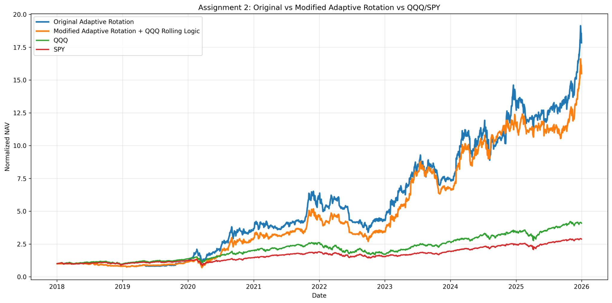

# Assignment 2 Report

Course: GR5398 26 Spring - FinRL-Trading Quantitative Trading Strategy Track  
Author: Ziqi Wang  
Backtest Window: 2018-01-01 to 2025-12-31  

## 1. Objective

This assignment implements the Adaptive Rotation Strategy and extends it using the QQQ rolling selection logic from Assignment 1. The goal is to reproduce the original Adaptive Rotation framework, build a modified version, and compare both strategies against QQQ and SPY benchmarks.

The comparison includes four portfolios:

- Original Adaptive Rotation Strategy
- Modified Adaptive Rotation Strategy with QQQ rolling selection logic
- QQQ benchmark
- SPY benchmark

The original strategy follows a rotation framework: it selects the strongest asset group using trailing Information Ratio, ranks assets inside that group using residual momentum, and rebalances weekly into the top two selected assets.

The modified strategy keeps the same structure, but adds an Assignment 1-inspired QQQ rolling selection filter to the Growth Tech sleeve. This tests whether momentum-based stock selection can improve the original Adaptive Rotation Strategy.

## 2. Strategy Design

### 2.1 Asset Groups

The strategy uses four asset groups.

**Growth Tech:** AAPL, MSFT, NVDA, META, AMZN, GOOGL, TSLA  
**Real Assets:** XOM, CVX, FCX, BHP, GLD, SLV  
**Defensive Assets:** TLT, IEF, XLU, XLV, IAU, SHY, UUP  
**Default Assets:** SPY, QQQ, IAU, XLU, XLV  

The economic intuition is that different assets lead in different market regimes. Growth stocks tend to perform better in risk-on bull markets, real assets can perform well during commodity or inflation cycles, and defensive assets can help reduce downside exposure during market stress.

## 3. Original Adaptive Rotation Strategy

### 3.1 Group Selection by Information Ratio

For each asset group, I calculate a trailing 12-week Information Ratio relative to QQQ:

`Information Ratio = mean(excess return) / standard deviation(excess return)`

This selection rule rewards groups with strong and consistent relative performance. It is more stable than selecting based only on raw return.

### 3.2 Intra-Group Ranking by Residual Momentum

After the strongest group is selected, assets inside the group are ranked by residual momentum. I calculate each asset's return relative to the average return of its group. Assets with stronger residual momentum are preferred because they are outperforming beyond the common movement of the group.

### 3.3 Weekly Rebalancing and Equal Weighting

The strategy rebalances weekly. At each rebalance date, it selects the top two assets from the chosen group and assigns equal weights. Therefore, the portfolio is concentrated and responsive to recent leadership changes.

## 4. Modified Adaptive Rotation Strategy

The modified strategy follows the same group selection, residual momentum ranking, weekly rebalancing, and equal-weight allocation process as the original strategy.

The main change is applied to the Growth Tech sleeve. When Growth Tech is selected as the active group, I apply a QQQ rolling selection pre-filter before residual momentum ranking.

### 4.1 QQQ Rolling Selection Logic

The rolling filter uses:

- 6-month momentum
- 12-month momentum
- a 4-week skip period to reduce short-term reversal noise
- 13-week volatility adjustment

The raw momentum score is:

`Raw Momentum Score = 0.5 x 6M Momentum + 0.5 x 12M Momentum`

Then the score is adjusted by recent volatility:

`Risk-Adjusted Score = Raw Momentum Score / Recent Volatility`

This filter favors assets with persistent momentum and penalizes names whose returns are mainly driven by high volatility.

### 4.2 Difference from the Original Strategy

The original strategy ranks all Growth Tech assets directly by residual momentum. The modified strategy first filters Growth Tech candidates using the QQQ rolling logic, and then applies the original residual momentum ranking to the filtered list.

The modified workflow is:

1. Select the strongest asset group using 12-week Information Ratio.
2. If the selected group is Growth Tech, apply QQQ rolling momentum and volatility filter.
3. Rank the remaining candidates by residual momentum.
4. Select the top two assets and equally weight them.

This keeps the original Adaptive Rotation structure while adding a meaningful stock-selection enhancement from Assignment 1.

## 5. Backtest Methodology

The backtest period is from 2018-01-01 to 2025-12-31. Daily adjusted close prices are downloaded from Yahoo Finance. Weekly prices are built using Friday close prices.

The strategy makes decisions on weekly rebalance dates and carries the selected weights forward until the next rebalance. To avoid look-ahead bias, daily portfolio returns are calculated using lagged weights. Transaction costs are included using a 10 bps cost rate applied to portfolio turnover.

The reported metrics are:

- cumulative return
- annualized return
- annualized volatility
- Sharpe ratio
- maximum drawdown

## 6. Backtest Results

| Portfolio | Cumulative Return | Annualized Return | Annualized Volatility | Sharpe Ratio | Max Drawdown |
|---|---:|---:|---:|---:|---:|
| Original Adaptive Rotation | 1683.62% | 43.39% | 36.71% | 1.18 | -49.08% |
| Modified Adaptive Rotation | 1448.50% | 40.88% | 35.19% | 1.16 | -49.53% |
| QQQ | 308.42% | 19.25% | 24.05% | 0.80 | -35.12% |
| SPY | 187.48% | 14.12% | 19.46% | 0.73 | -33.72% |

Chart:

## 7. Result Analysis

The original Adaptive Rotation Strategy strongly outperformed QQQ and SPY during the 2018-2025 backtest period. It achieved a cumulative return of 1683.62% and an annualized return of 43.39%, compared with 308.42% and 19.25% for QQQ.

However, this return came with materially higher risk. The original strategy had annualized volatility of 36.71% and a maximum drawdown of -49.08%. This is much more aggressive than the benchmarks because the strategy usually holds only two assets at a time.

The modified strategy also significantly outperformed QQQ and SPY. It achieved a cumulative return of 1448.50% and an annualized return of 40.88%. However, it did not outperform the original Adaptive Rotation Strategy in total return.

The modified strategy slightly reduced annualized volatility from 36.71% to 35.19%. This suggests that the QQQ rolling filter made the strategy somewhat more conservative by filtering the Growth Tech sleeve through a risk-adjusted momentum rule.

The trade-off is that filtering also removed some high-upside opportunities. As a result, the modified strategy had lower total return than the original version, even though it maintained strong performance relative to QQQ and SPY.

## 8. Interpretation

The results show that the Adaptive Rotation framework is effective because it dynamically shifts capital toward stronger asset groups instead of holding a fixed portfolio.

The original strategy performed best in terms of total return. This likely happened because the concentrated top-two asset structure captured strong winners during the sample period.

The modified strategy was designed to improve the stock selection step inside the Growth Tech sleeve. The rolling momentum filter helped make the strategy more selective and slightly less volatile, but it did not improve absolute return. This is still a useful result: the modification changes the risk-return profile of the strategy rather than simply increasing return.

Therefore, the modified version should be interpreted as a conservative enhancement. It preserved strong outperformance versus QQQ and SPY while reducing volatility slightly, but it gave up some upside relative to the original strategy.

## 9. Limitations

There are several limitations.

First, the portfolio is highly concentrated because it holds only two assets after each rebalance. This can generate strong performance but also increases drawdown risk.

Second, the QQQ rolling filter is only applied to the Growth Tech sleeve. When the selected group is Real Assets, Defensive Assets, or Default Assets, the modified strategy behaves the same as the original strategy.

Third, the rolling filter uses fixed parameters: 6-month momentum, 12-month momentum, a 4-week skip, and 13-week volatility. Different parameter choices could lead to different results.

Fourth, the backtest uses adjusted close prices and does not fully model real execution frictions such as bid-ask spreads, market impact, or intraday execution timing.

## 10. Conclusion

This project implemented the original Adaptive Rotation Strategy and a modified version that integrates Assignment 1 QQQ rolling selection logic.

The original strategy achieved the highest return, with cumulative return of 1683.62% and annualized return of 43.39%. The modified strategy achieved cumulative return of 1448.50% and annualized return of 40.88%.

Although the modified strategy did not outperform the original version, it still significantly outperformed QQQ and SPY. It also slightly reduced volatility, suggesting that the QQQ rolling logic worked more as a risk-adjusted filter than as a pure return enhancer.

Overall, the experiment shows that the Adaptive Rotation framework is effective and that Assignment 1 rolling selection logic can be integrated as a meaningful modification. Future work could test the rolling filter across all asset groups, apply volatility targeting, or use a more explicit regime detection model.

## 11. Output Files

- `assignment2_outputs/comparison_chart.png`
- `assignment2_outputs/comparison_metrics.csv`
- `assignment2_outputs/comparison_nav.csv`
- `assignment2_outputs/original_weights.csv`
- `assignment2_outputs/modified_weights.csv`
- `assignment2_outputs/original_decisions.csv`
- `assignment2_outputs/modified_decisions.csv`
- `assignment2_outputs/original_backtest.csv`
- `assignment2_outputs/modified_backtest.csv`
