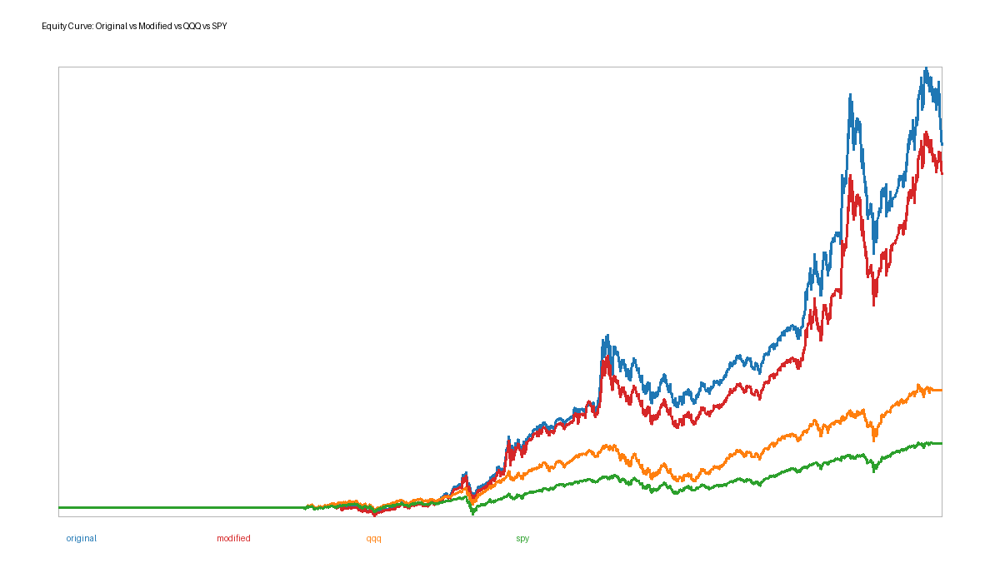
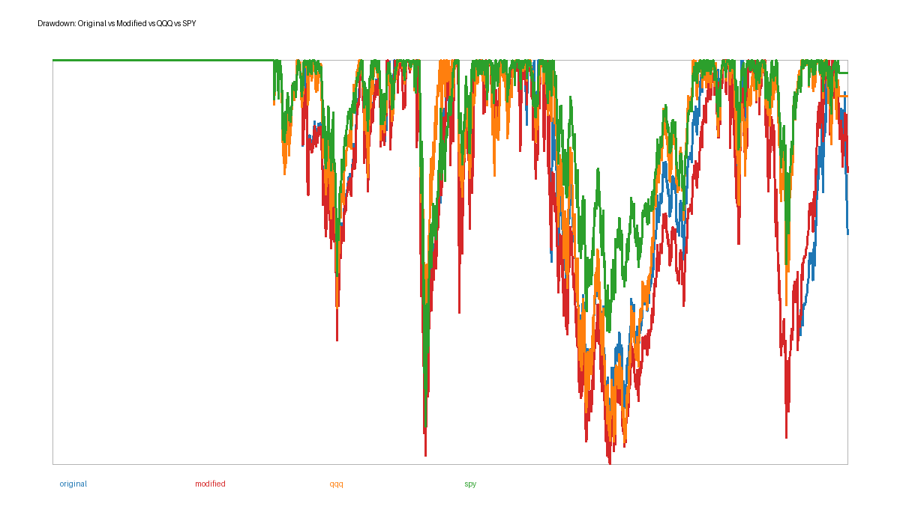

# Adaptive Rotation Strategy with QQQ Rolling Selection Enhancement

## Strategy Overview
This report compares the original Adaptive Rotation Strategy, a modified version with Rui's Assignment 1 QQQ rolling selection enhancement, QQQ, SPY, and an equal-weight benchmark. Multiple groups diversify leadership regimes; Information Ratio selects the active group; residual momentum ranks assets; weekly rebalancing controls turnover; and a drawdown overlay responds to losses.

## Original Strategy Methodology
The original strategy uses 12-week group IR, SPY 200-day moving-average regime filtering, top-2 residual momentum selection, equal weights, and a drawdown risk overlay.

## Modified Strategy Methodology
Rui's Assignment 1 logic was recovered from `FinRL-Trading-Full-Workload.ipynb`, `outputs_step2/stock_selected.csv`, and `strategy_framework/strategies/equal_weight_topk.py`. Assignment 1 selects the top 25 percent of ML-predicted names by trade date and improves allocation with sector-neutral predicted-return residuals, robust z-scores, dynamic Top-N, and hysteresis. Here it is integrated as a Growth Tech pre-filter using history-only QQQ rolling momentum plus Assignment 1 predicted-return scores where available.

## Backtest Setup
Data source note: local Assignment 1 fallback prices used because yfinance was unavailable or rate-limited

Date range starts at `2015-01-01`. Rebalance timing is weekly. Signals use data before the holding week, and daily returns apply weights with a one-day lag. Transaction cost is `2.0` bps per turnover.

## Backtest Results
| strategy | cumulative_return | annualized_return | annualized_volatility | sharpe_ratio | max_drawdown | cagr | calmar_ratio | number_of_rebalances | average_turnover | hit_rate |
|---|---:|---:|---:|---:|---:|---:|---:|---:|---:|---:|
| original | 8.7445 | 0.2275 | 0.2570 | 0.8853 | -0.3644 | 0.2275 | 0.6242 | 580.0000 | 1.4118 | 0.3961 |
| modified | 8.0359 | 0.2192 | 0.2562 | 0.8556 | -0.3758 | 0.2192 | 0.5832 | 580.0000 | 1.4038 | 0.3950 |
| qqq | 2.8344 | 0.1286 | 0.2032 | 0.6331 | -0.3562 | 0.1286 | 0.3611 | 0.0000 | 0.0000 | 0.3982 |
| spy | 1.5476 | 0.0878 | 0.1647 | 0.5334 | -0.3410 | 0.0878 | 0.2576 | 0.0000 | 0.0000 | 0.3918 |
| equal_weight_optional | 21.1214 | 0.3215 | 0.2636 | 1.2195 | -0.4520 | 0.3215 | 0.7114 | 0.0000 | 0.0000 | 0.5585 |

## Research Questions
Does QQQ rolling selection improve the Growth Tech sleeve? The modified strategy isolates that layer, so differences versus original show the effect when Growth Tech is selected.
Does the modified strategy improve Sharpe ratio? No.
Does the modified strategy reduce max drawdown? No.
Is improvement stable or regime-dependent? It is regime-dependent because the enhancement only affects Growth Tech.
Which layer matters most? This experiment isolates intra-group ranking; group selection still controls broad exposure.
What trade-off exists? Top-2 concentration can increase upside capture and idiosyncratic drawdown.
If better, the mechanism is stronger Growth Tech pre-filtering. If worse, the pre-filter removed names residual momentum would have preferred.

## Failure Analysis
Lookback sensitivity, regime lag, residual momentum instability, top-2 concentration, transaction costs, QQQ benchmark dominance, and Assignment 1 overfitting risk are the main weaknesses.

## Conclusion
Modified beat original on Sharpe: no. Modified beat QQQ on cumulative return: yes. Future work should test independent OOS periods and less concentrated sizing.
