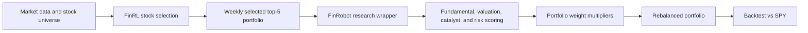

# When Quant Meets Research: Building a Multi-Stage AI Equity Strategy That Beat SPY

## A practical portfolio pipeline that combines FinRL stock selection with point-in-time FinRobot research scoring to improve sizing, reduce weak exposures, and raise risk-adjusted returns.

There is a temptation in AI-for-investing projects to let one model do everything: select stocks, read news, interpret fundamentals, and make the final decision. I took the opposite approach.

Instead of building one oversized decision engine, I built a layered strategy pipeline in which each module has a clear job. **FinRL** serves as the primary stock selector, surfacing a small weekly portfolio from a universe of large-cap names. **FinRobot** then acts as a research overlay, using fundamentals, valuation, and historical news to decide which of those selected stocks deserve more capital and which deserve less.

The result was simple, interpretable, and surprisingly effective. Over the backtest period from **January 2026 through April 2026**, the combined strategy returned **18.91%**, outperforming both **FinRL-only at 14.20%** and **SPY at 5.48%**.

> "The key idea was not to replace quantitative stock selection with generative AI, but to use research intelligence as a second filter on top of an already functioning portfolio engine."

## Why I Designed the Strategy This Way

FinRL is strong at finding candidates using machine-learning and technical signals. But a ranked stock is not automatically a well-sized position. A stock can screen well in a model and still have weak short-term catalysts, stretched valuation, or deteriorating business quality.

That gap is exactly where I used FinRobot.

The strategy therefore asks two different questions:

- **FinRL:** Which stocks should enter the portfolio this week?
- **FinRobot:** Among those selected stocks, which ones deserve higher conviction?

This division of labor made the architecture much easier to explain and audit. Rather than letting one black-box score dominate everything, the system separates **selection** from **validation**.

## System Architecture

At a high level, the strategy works as a sequential pipeline:



The pipeline is intentionally modular. FinRL determines membership. FinRobot determines sizing. The final portfolio is then backtested against SPY and compared with the original FinRL equal-weight portfolio.

**Figure 1.** Multi-stage strategy pipeline. FinRL generates weekly stock picks, and FinRobot converts point-in-time research evidence into portfolio weight adjustments.

## What the Strategy Actually Traded

The backtest used a weekly selected portfolio drawn from **11 large-cap stocks**:

`AMAT, AMD, AMZN, COST, CSCO, GOOGL, ISRG, META, NFLX, TSLA, TXN`

Across the sample, the system ran over **17 weekly rebalance dates**, with **5 holdings per week**, producing **85 total ticker-date selections**.

The initial FinRL portfolio was equal-weighted. After that, the FinRobot overlay adjusted those weights based on research quality.

## How the FinRobot Overlay Worked

The FinRobot layer was designed as a **point-in-time confirmation engine**. That point is important. I did not allow the model to look into future financial filings or future news.

For every selected `date, ticker` pair, the FinRobot wrapper computed a composite research score from four building blocks:

- **Business quality**
- **Valuation**
- **Catalyst strength**
- **Risk penalty**

The final score was:

```text
FinRobot Score =
0.45 * Business Quality
+ 0.25 * Valuation
+ 0.20 * Catalyst
+ 0.10 * Risk
```

### Business Quality

This component combined both absolute and peer-relative measures of company strength. It used variables such as:

- revenue growth
- EBITDA margin
- contribution margin
- EPS
- free cash flow quality
- operating cash flow margin
- debt-to-equity
- current ratio
- return on equity

### Valuation

Valuation was measured relative to peers using:

- PE ratio
- EV/EBITDA
- free cash flow yield

Lower PE and EV/EBITDA improved the score, while higher free cash flow yield improved the score.

### Catalysts and Risk

The catalyst and risk components were built using a **30-day rolling historical news window** ending at each rebalance date. Only articles published **on or before** the rebalance date were included.

This mattered because it avoided one of the biggest problems in AI finance projects: silent look-ahead bias.

> "A large part of the project was not inventing fancy signals. It was making sure every signal was truly available at the moment the portfolio decision was made."

## From Research Score to Portfolio Action

Once the FinRobot score was computed, it was mapped into one of four portfolio actions:

- `score >= 0.80` -> `strong_keep` -> multiplier `1.20`
- `0.60 <= score < 0.80` -> `keep` -> multiplier `1.00`
- `0.45 <= score < 0.60` -> `reduce` -> multiplier `0.70`
- `score < 0.45` -> `reject` -> multiplier `0.00`

These multipliers were applied to the equal-weight FinRL portfolio and then renormalized within each rebalance date.

**Figure 2.** Weight-adjustment rule. FinRobot does not replace FinRL stock selection; it reweights the selected stocks according to research conviction.

## Backtest Results

This is where the architecture paid off.

| Strategy | Total Return | Sharpe Ratio | Max Drawdown | Volatility |
|---|---:|---:|---:|---:|
| FinRL-only | 14.20% | 1.91 | -13.11% | 23.04% |
| FinRL + no-lookahead FinRobot | 18.91% | 2.36 | -13.66% | 24.12% |
| SPY | 5.48% | 1.24 | -8.89% | 14.23% |

The combined strategy outperformed both baselines:

- It beat **SPY** by a wide margin in total return.
- It improved meaningfully over **FinRL-only**.
- It achieved the **highest Sharpe ratio** of the three.

By the end of the sample, $1 grew to:

- **$1.189** in the combined strategy
- **$1.142** in FinRL-only
- **$1.055** in SPY

**Figure 3.** Equity curve comparison for FinRL-only, FinRL + no-lookahead FinRobot, and SPY from January 2026 through April 2026. The research overlay increased both terminal return and risk-adjusted performance.

Another useful signal was daily win rate:

- **FinRL-only:** `57.5%`
- **FinRL + FinRobot:** `63.8%`
- **SPY:** `51.9%`

That suggests the overlay did not just benefit from one or two lucky trades. It improved the consistency of day-to-day portfolio outcomes.

## What Each Module Added

The contribution analysis makes the story even clearer.

The largest positive effects came from:

- **AMD**: higher average weight and strong realized return
- **AMAT**: overweighted during a favorable sample
- **TXN**: modest overweight with strong return contribution
- **GOOGL** and **AMZN**: both received more capital and added positive active contribution

But the most important single adjustment may have been **TSLA**.

TSLA was rejected **7 times** by the FinRobot overlay. That mattered because TSLA's realized performance during the sample was weak. In other words, FinRobot did not merely pick more winners. It also helped the strategy avoid forcing equal capital into weak names that FinRL had still selected.

> "The overlay was valuable not only because it overweighted strong stocks, but because it gave the portfolio permission to say no."

This is exactly the kind of behavior I wanted from a research layer. A useful overlay should be selective. It should not exist just to confirm every existing position.

## Where the Strategy Still Failed

The result was strong, but not perfect.

First, the backtest period is short. The strategy covers **17 weekly rebalances** and **81 trading days**, which is enough for a proof of concept but not enough to claim robustness across multiple market regimes.

Second, the universe is narrow. Only **11 large-cap names** were involved. That means a few decisions can drive a large share of total performance.

Third, the system still made mistakes. For example, **META** received a higher average weight, but its active contribution was slightly negative. That suggests the overlay can still misread near-term timing even when a company's fundamentals appear attractive.

Fourth, concentration remains a real issue. Even after renormalization, the largest single position sometimes reached roughly **30%** of the portfolio on a rebalance date. That is reasonable for a five-stock concentrated strategy, but it also means mistakes can hurt quickly.

**Figure 4.** Failure modes of the system include over-filtering, concentration risk, short sample dependence, and timing errors in the research overlay.

## Why the Combined System Worked

The final strategy beat SPY because the modules were complementary.

FinRL provided a disciplined shortlist of candidates. FinRobot improved the quality of the final capital allocation by rewarding stronger businesses, better valuations, and more favorable near-term news setups, while reducing exposure to weaker names.

That combination is what turned a decent quantitative strategy into a better portfolio.

The most important takeaway is not just that the strategy outperformed, but that it did so in an explainable way. The system did not rely on vague AI intuition. It used a structured division of labor:

- quantitative ranking for selection
- research scoring for conviction
- transparent rules for sizing

## What I Would Improve Next

If I were extending this project, I would focus on five improvements:

- Run the strategy across a longer historical period
- Expand the universe beyond 11 large-cap stocks
- Add sector and concentration controls
- Integrate a fully audited FinGPT sentiment layer
- Compare each module in isolation across different market regimes

Those changes would turn this from a strong class project into a more serious research framework.

## Final Takeaway

The strategy did beat SPY, and it did so for sensible reasons.

By separating stock selection from research validation, the pipeline became more robust, more interpretable, and more effective than either a pure benchmark portfolio or the FinRL baseline alone. In this project, the best result did not come from asking one AI system to do everything. It came from letting each system do one job well.
